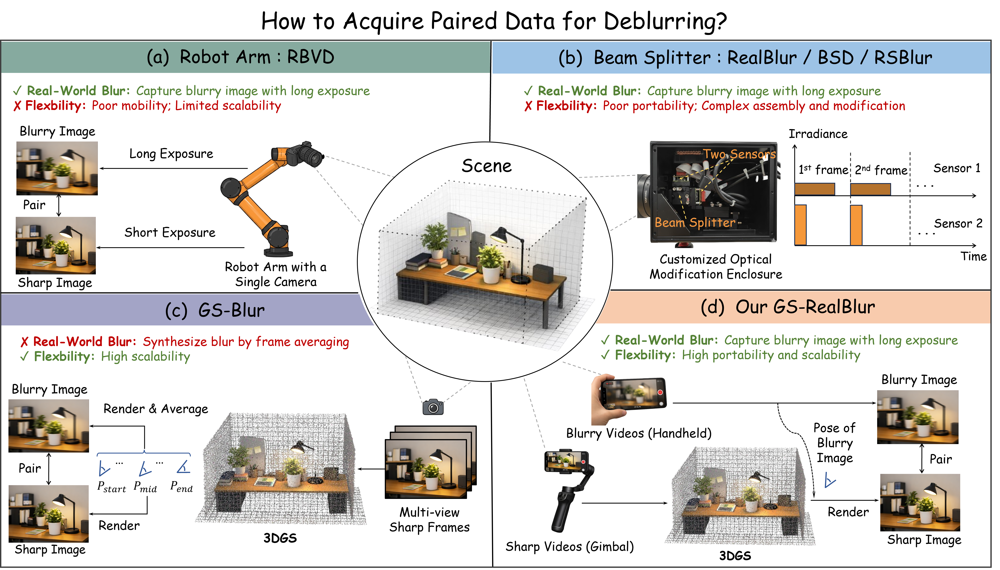
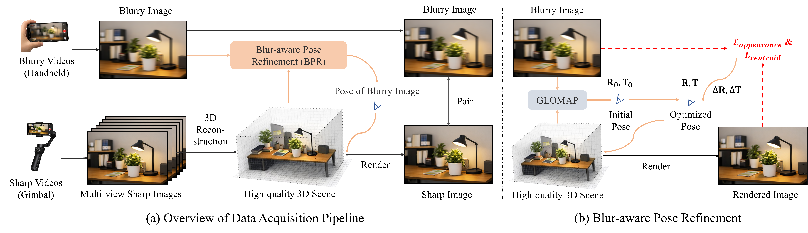
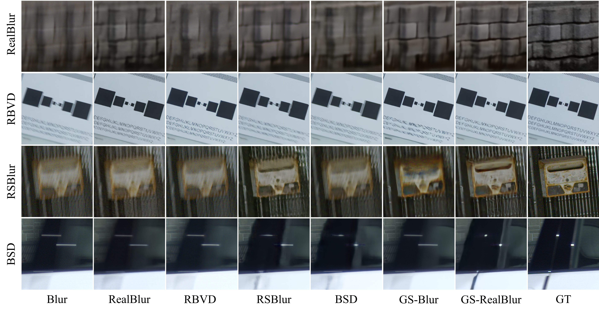
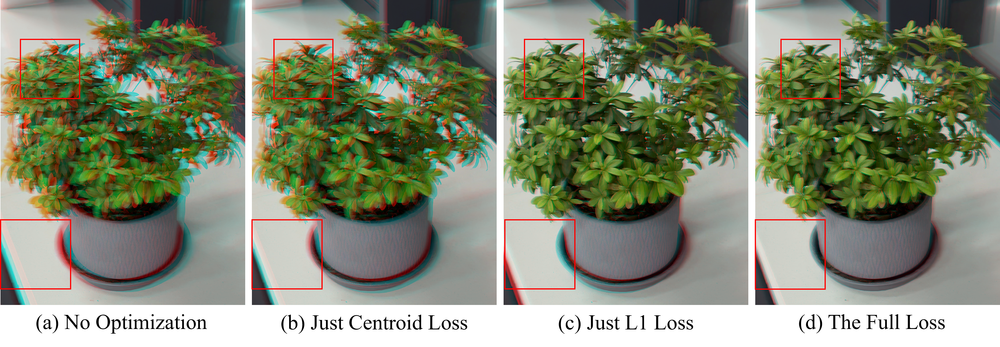

# GS-RealBlur: A Flexible Data Acquisition Framework for Real-World Image Deblurring

Mingyang Chen, Zhilu Zhang, Honglei Xu, Renlong Wu, Xiaohe Wu, Wangmeng Zuo  
Harbin Institute of Technology, Harbin, China

[-1f2a44?style=for-the-badge)](assets/paper/GS-RealBlur.pdf)

## Abstract

High-quality, large-scale paired data is essential for training learning-based image deblurring models. However, synthetic blurry images generally lack realism, while real-world captured images require complex and inflexible camera systems. In this work, we propose GS-RealBlur, a data acquisition framework for real-world image deblurring, achieving both blur realism and acquisition flexibility. Specifically, we use a handheld camera to capture blurry images, and deploy a gimbal to densely capture sharp images of the same scene. We reconstruct the 3D representation of sharp images and calibrate the camera pose of each blurry frame within this 3D. The image rendered from this 3D according to the pose serves as the sharp counterpart. To better align the rendered image with the blurry image, we introduce a Blur-aware Pose Refinement (BPR) module that refines the pose using appearance consistency and centroid alignment constraints. Leveraging GS-RealBlur, we construct a high-quality and diverse dataset. Extensive experiments demonstrate that a deblurring model trained on our dataset achieves superior generalization performance across various real-world deblurring benchmarks.

## What Makes GS-RealBlur Different?

Existing paired-data pipelines trade blur realism against acquisition flexibility. Robot-arm and beam-splitter systems capture real blur but depend on specialized, non-portable hardware, while synthetic pipelines do not directly reproduce physical blur formation. GS-RealBlur captures real blur with portable consumer devices and uses 3D Gaussian Splatting to render spatially aligned sharp supervision.

## Method Overview

GS-RealBlur densely captures sharp-view videos with a gimbal for 3DGS reconstruction, then captures real-world blurry images in handheld mode. GLOMAP provides the initial blurry-frame pose, while Blur-aware Pose Refinement jointly uses appearance consistency and blur-kernel centroid alignment to obtain an aligned sharp rendering.

## Experiments

### Cross-Dataset Generalization

Models trained on existing datasets exhibit considerable degradation when evaluated on other real-world benchmarks. The representative NAFNet results below show that GS-RealBlur achieves the best average cross-domain performance. Each value is **PSNR / SSIM / LPIPS**; red denotes the best and blue denotes the second best result.

**Cross-dataset evaluation with NAFNet. Each cell is PSNR / SSIM / LPIPS.**

| Training Set | RealBlur | RBVD | RSBlur | BSD | Average |
| --- | --- | --- | --- | --- | --- |
| RealBlur | **28.89 / .907 / .151** | 26.00 / .892 / .249 | 30.61 / .824 / .342 | 30.00 / .914 / .125 | 28.88 / .884 / .221 |
| RBVD | 27.16 / .863 / .228 | <b>26.51 / .907</b> / .231 | 29.59 / .793 / .388 | 29.36 / .907 / .136 | 28.16 / .867 / .246 |
| RSBlur | 27.23 / .871 / .180 | 26.36 / .905 / .234 | **33.72 / .877 / .310** | 30.78 / .923 / .119 | <b>29.54</b> / .894 / .211 |
| BSD | 26.88 / .864 / .217 | 26.36 / .902 / .248 | 30.93 / .832 / .377 | **33.87 / .952 / .078** | 29.53 / .888 / .230 |
| GS-Blur | 27.33 / .879 / <b>.147</b> | 26.26 / .904 / <b>.201</b> | 32.87 / .860 / .317 | 31.37 / .934 / .109 | 29.46 / <b>.895 / .192</b> |
| GS-RealBlur | <b>27.67 / .886</b> / **.140** | **26.71 / .910 / .186** | <b>33.15 / .863 / .311</b> | <b>31.92 / .939 / .093</b> | **29.86 / .900 / .183** |

The project page provides the complete carousel for NAFNet, Restormer, and EVSSM. The following qualitative comparison corresponds to the cross-dataset evaluation.

### Out-of-Distribution Evaluation

On RWBI and DVD-Test, GS-RealBlur achieves the highest scores across all six reported no-reference metrics, showing robust perceptual quality beyond the training-domain benchmarks. Higher is better for every metric.

| Training Set | RWBI MUSIQ | RWBI MANIQA | RWBI CLIP-IQA | DVD-Test MUSIQ | DVD-Test MANIQA | DVD-Test CLIP-IQA |
| --- | ---: | ---: | ---: | ---: | ---: | ---: |
| RealBlur | 58.552 | .266 | .341 | 45.040 | .231 | .290 |
| RBVD | 52.014 | .258 | .313 | 40.970 | .206 | .224 |
| RSBlur | 57.929 | .264 | .335 | 41.132 | .217 | .274 |
| BSD | 58.104 | .273 | .336 | 40.595 | .214 | .275 |
| GS-Blur | 61.330 | .295 | .367 | 45.371 | .235 | .284 |
| GS-RealBlur | **61.610** | **.300** | **.372** | **46.604** | **.242** | **.294** |

### BPR Ablation

Blur weakens feature matching and makes SfM pose estimates unreliable. BPR refines the inaccurate pose using learnable rotation and translation offsets optimized by appearance consistency and blur-kernel centroid alignment. Their combination gives the best pose accuracy and deblurring performance.

| Lappearance | Lcentroid | Pose Error (TE / RE) | RealBlur | RBVD | RSBlur | BSD |
| ---: | ---: | --- | --- | --- | --- | --- |
| × | × | 1.036 / 1.102 | 27.38 / .880 | 26.46 / .899 | 32.61 / .854 | 31.42 / .930 |
| ✓ | × | .702 / .503 | 27.52 / .884 | 26.63 / .907 | 32.95 / .858 | 31.59 / .935 |
| × | ✓ | .452 / .841 | 27.43 / .883 | 26.52 / .903 | 32.75 / .856 | 31.51 / .934 |
| ✓ | ✓ | **.445 / .479** | **27.57 / .885** | **26.67 / .908** | **33.13 / .861** | **31.63 / .936** |

## Dataset Patch Samples

The dataset includes aligned blurry--sharp patch pairs from diverse real-world scenes. Visit the [interactive project page](https://youngmchan.github.io/GS-RealBlur/#dataset-samples) to drag the divider and compare the blurry observation with its aligned ground truth.

## Links

- [Project Page](https://youngmchan.github.io/GS-RealBlur/)
- [Paper (PDF)](assets/paper/GS-RealBlur.pdf)
- [Code](https://github.com/youngmchan/GS-RealBlur)
